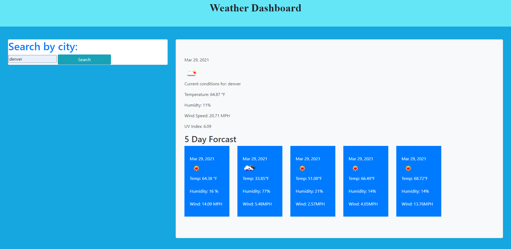

# 06-Weather-dashboard
This project is intended to provide an app that will let the user check weather conditions after filling out a form statement.

WHEN I search for a city I am presented with current and future conditions for that city and that city is added to the search history.
WHEN I view current weather conditions for that city I am presented with the city name, the date, an icon representation of weather conditions, the temperature, the humidity, the wind speed, and the UV index.
WHEN I view the UV index I am presented with a color that indicates whether the conditions are favorable, moderate, or severe.
WHEN I view future weather conditions for that city I am presented with a 5-day forecast that displays the date, an icon representation of weather conditions, the temperature, and the humidity.
WHEN I click on a city in the search history I am again presented with current and future conditions for that city.

The URL of the deployed application: https://ncclymer.github.io/06-Weather-dashboard/

The URL of the GitHub repository: https://github.com/ncclymer/06-Weather-dashboard

Screen shot: 

